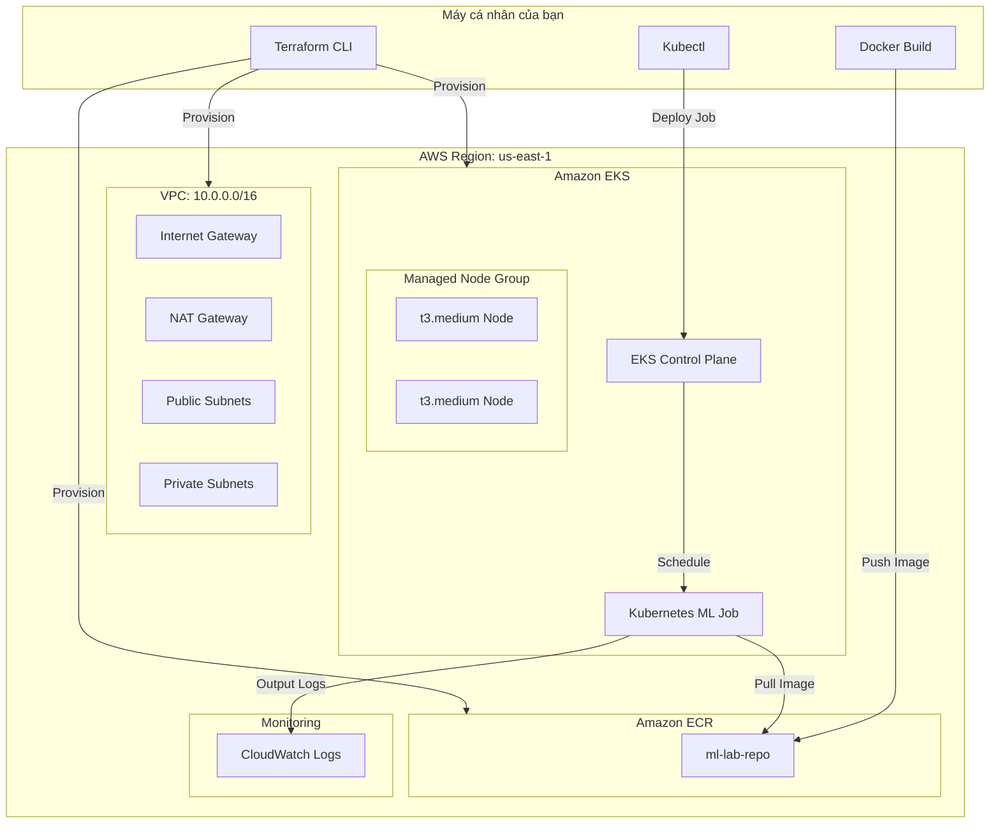

# Tài liệu Hướng dẫn & Kiến trúc Hệ thống ML trên EKS

Tài liệu này mô tả chi tiết kiến trúc hạ tầng và quy trình triển khai (workflow) cho bài Lab thiết lập môi trường Machine Learning Job trên AWS sử dụng Terraform và Amazon EKS.

## 1. Kiến trúc Hệ thống (Architecture)

Hệ thống được thiết kế theo mô hình chuẩn Production với mạng VPC phân lớp, đảm bảo tính bảo mật và khả năng mở rộng.

### Thành phần chính:
*   **VPC & Networking:** Sử dụng module `terraform-aws-modules/vpc`. Bao gồm Public Subnets (cho NAT Gateway/LB) và Private Subnets (cho EKS Nodes).
*   **Amazon ECR:** Nơi lưu trữ Docker Image của ứng dụng ML.
*   **Amazon EKS:** Cụm Kubernetes quản lý việc chạy container.
*   **Managed Node Group:** Các máy ảo EC2 (`t3.medium`) tự động được EKS quản lý, nằm trong mạng riêng tư để đảm bảo an toàn.

---

## 2. Quy trình triển khai (Workflow)

Quy trình được thực hiện theo 4 giai đoạn chính:

### Giai đoạn 1: Khởi tạo Hạ tầng (IaC)
Sử dụng Terraform để định nghĩa và tạo toàn bộ tài nguyên AWS. Việc này giúp hạ tầng có tính nhất quán và dễ dàng xóa bỏ (destroy) sau khi dùng.
*   **Công cụ:** `terraform`
*   **Kết quả:** Có VPC, cụm EKS trống và một Repo ECR.

### Giai đoạn 2: Đóng gói Ứng dụng (Containerization)
Ứng dụng ML (Scikit-learn) được đóng gói vào Docker Image.
*   **Công cụ:** `docker`
*   **Luồng:** Build image locally -> Gắn tag -> Đẩy (Push) lên Amazon ECR.

### Giai đoạn 3: Điều phối Công việc (Orchestration)
Kích hoạt ML Job trên cụm EKS.
*   **Công cụ:** `kubectl`
*   **Luồng:** Cập nhật `kubeconfig` -> Apply file `ml-job.yaml`. EKS sẽ tự động kéo image từ ECR về các Node và thực thi.

### Giai đoạn 4: Giám sát & Phân tích (Monitoring)
Kiểm tra kết quả thực thi và chi phí.
*   **Công cụ:** `kubectl logs`, AWS Billing Dashboard.
*   **Mục tiêu:** Đo lường thời gian chạy (latency) và chi phí thực tế của các dịch vụ Cloud.

---

## 3. Các lưu ý về Chi phí & Hiệu năng

| Dịch vụ | Loại phí | Ghi chú |
| :--- | :--- | :--- |
| **EKS Cluster** | $0.10 / giờ | Phí cố định cho Control Plane. |
| **EC2 Nodes** | ~$0.0416 / giờ / node | Instance loại `t3.medium`. |
| **NAT Gateway** | ~$0.045 / giờ | Cần thiết để Private Nodes tải thư viện/image. |
| **EKS Node Group** | Theo cấu hình | Đang để tối thiểu 1, tối đa 2 nodes. |

> [!CAUTION]
> **HÀNH ĐỘNG BẮT BUỘC:** Sau khi hoàn thành thực hành, bạn phải chạy `terraform destroy` để xóa NAT Gateway và EKS Cluster, vì đây là các dịch vụ tính phí theo thời gian chạy (Hourly).
