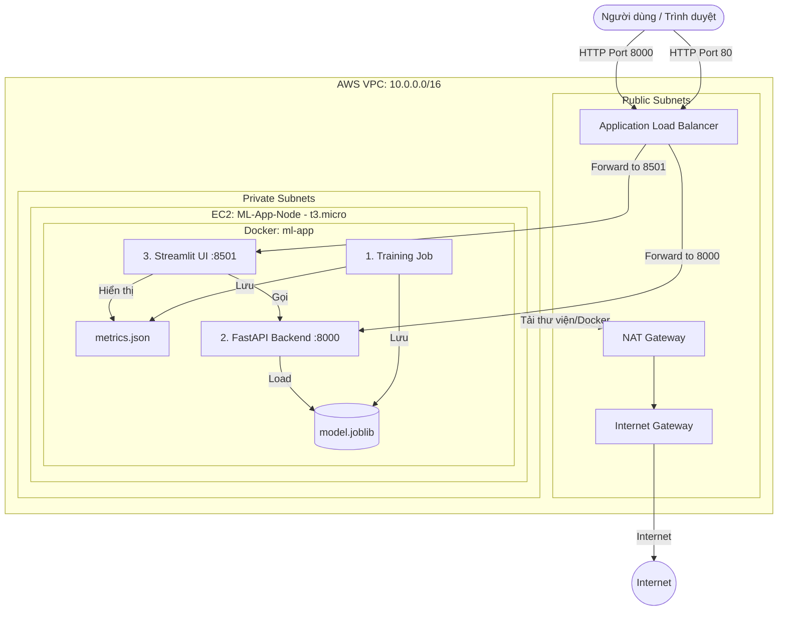

# 🚀 Hướng dẫn Triển khai Hệ thống ML Đơn giản trên AWS (Simplified Lab 16)

Tài liệu này hướng dẫn bạn cách triển khai một ứng dụng Machine Learning (Iris Classifier) hoàn chỉnh trên AWS bằng Terraform. Hệ thống bao gồm:
- **FastAPI**: Cung cấp API dự đoán và Monitoring metrics.
- **Streamlit**: Giao diện người dùng (UI) để tương tác và xem biểu đồ giám sát.
- **Docker**: Đóng gói toàn bộ ứng dụng.
- **AWS Infrastructure**: VPC Private, NAT Gateway, Application Load Balancer (ALB), và EC2 Node.

---

## 1. Kiến trúc Hệ thống (Architecture)

Hệ thống được thiết kế theo mô hình chuẩn bảo mật trên AWS với VPC phân tầng. Ứng dụng chạy trong mạng riêng (Private Subnet) và chỉ có thể truy cập được thông qua Load Balancer.



### Các thành phần chính:
- **VPC & Networking**: Chia làm 2 lớp Public và Private. Các tài nguyên tính toán (EC2 t3.micro) nằm trong Private Subnet để đảm bảo an toàn.
- **ALB (Application Load Balancer)**: Đóng vai trò là cửa ngõ tiếp nhận request và phân phối vào ứng dụng.
- **NAT Gateway**: Cho phép máy chủ trong Private Subnet kết nối ra Internet để tải thư viện nhưng không cho phép chiều ngược lại.
- **Docker Container**: Đóng gói và chạy đồng thời quy trình Huấn luyện, API và UI.

---

## 2. Các thành phần Metrics được tích hợp
Hệ thống không chỉ dự đoán mà còn cung cấp các chỉ số quan trọng:
- **Model Metrics**: Accuracy, Precision, Recall, F1-Score (tính toán sau khi Training).
- **System Metrics**: CPU & Memory usage trong quá trình Training.
- **Inference Metrics**: Độ trễ (Latency) theo thời gian thực và biểu đồ lịch sử dự đoán trên giao diện Streamlit.
- **Prometheus Metrics**: Sẵn sàng cho việc giám sát chuyên sâu qua endpoint `/metrics` của API.

---

## 3. Các bước triển khai

### Bước 2.1: Chuẩn bị môi trường Local
Đảm bảo bạn đã cài đặt:
- **AWS CLI** (đã cấu hình `aws configure`)
- **Terraform**

### Bước 2.2: Khởi tạo Hạ tầng
Di chuyển vào thư mục `terraform` và thực hiện:

```bash
cd terraform
# Khởi tạo terraform
terraform init

# Kiểm tra tính hợp lệ
terraform validate

# Triển khai (mất khoảng 10-12 phút chủ yếu do NAT Gateway)
terraform apply -auto-approve
```

### Bước 2.3: Truy cập Ứng dụng
Sau khi `terraform apply` thành công, bạn sẽ nhận được các Outputs quan trọng:
- `ui_url`: Truy cập vào đây bằng trình duyệt để sử dụng giao diện Streamlit.
- `api_url`: Endpoint của FastAPI (dùng để test curl hoặc tích hợp hệ thống khác).

**Lưu ý:** Sau khi Terraform báo thành công, EC2 Node cần thêm khoảng 2-3 phút để cài đặt Docker, Build image và chạy Training lần đầu tiên. Hãy kiên nhẫn đợi một chút nếu chưa truy cập được ngay.

---

## 4. Hướng dẫn Giám sát (Detailed Monitoring)

Hệ thống được thiết kế để giám sát đa lớp:

### 4.1. Giám sát trên Giao diện Streamlit (Application Level)
- **Training Metrics**: Xem kết quả huấn luyện mô hình (Accuracy, F1...) và tài nguyên hệ thống (CPU/RAM) tiêu thụ lúc huấn luyện ngay tại thanh bên trái.
- **Inference Metrics**: Biểu đồ Latency sẽ cập nhật ngay lập tức mỗi khi bạn thực hiện một dự đoán mới.

### 4.2. Kiểm tra qua API (cURL)
Bạn có thể dùng lệnh cURL một dòng sau để kiểm tra nhanh (thay `<ALB_DNS_NAME>` bằng giá trị từ output):

**Dành cho CMD / Bash:**
```bash
curl -X POST http://<ALB_DNS_NAME>:8000/predict -H "Content-Type: application/json" -d "{\"sepal_length\": 5.1, \"sepal_width\": 3.5, \"petal_length\": 1.4, \"petal_width\": 0.2}"
```

**Dành cho PowerShell:**
```powershell
curl.exe -X POST http://<ALB_DNS_NAME>:8000/predict -H "Content-Type: application/json" -d '{\"sepal_length\": 5.1, \"sepal_width\": 3.5, \"petal_length\": 1.4, \"petal_width\": 0.2}'
```

- Ngoài ra, truy cập `<api_url>/metrics` để xem dữ liệu thô định dạng Prometheus.

### 4.3. Giám sát trên AWS CloudWatch (Infrastructure Level)
Để xem các chỉ số hạ tầng, bạn hãy truy cập [CloudWatch Console](https://console.aws.amazon.com/cloudwatch/):
- **ALB Metrics**: Vào mục **Metrics** -> **All Metrics** -> **ApplicationELB**. Tại đây bạn có thể theo dõi:
    - `RequestCount`: Số lượng request đến hệ thống.
    - `TargetResponseTime`: Thời gian phản hồi của ứng dụng.
    - `HTTPCode_Target_2XX_Count`: Số lượng request thành công.
- **EC2 Metrics**: Vào mục **Metrics** -> **All Metrics** -> **EC2**. Theo dõi:
    - `CPUUtilization`: Phần trăm CPU của máy chủ.
    - `NetworkIn / NetworkOut`: Lưu lượng mạng.

---

## 5. Kiểm tra Log & Troubleshooting

Nếu gặp lỗi (như 502 Bad Gateway hoặc không thấy metrics), bạn có thể kiểm tra log như sau:

1. **User-data Log (Quá trình cài đặt)**:
   Xem nhật ký quá trình cài Docker và chạy ứng dụng lần đầu:
   ```bash
   # Truy cập vào máy qua SSH (thông qua Bastion)
   tail -f /var/log/user-data.log
   ```

2. **Docker Logs (Quá trình chạy App)**:
   Xem log của container đang chạy (FastAPI & Streamlit logs):
   ```bash
   docker logs -f ml-app-container
   ```

3. **ALB Health Checks**:
   Vào EC2 Console -> **Target Groups** -> Chọn TG của bạn -> **Targets**. Kiểm tra cột **Health status**. Nếu là `Unhealthy`, hãy xem mô tả lỗi ngay tại đó.

---

## 6. Dọn dẹp tài nguyên (CỰC KỲ QUAN TRỌNG)
Để tránh phát sinh chi phí không đáng có (đặc biệt là NAT Gateway và ALB), bạn **BẮT BUỘC** phải xóa tài nguyên sau khi kết thúc:

```bash
terraform destroy -auto-approve
```

---
*Chúc bạn có buổi thực hành thành công!*
