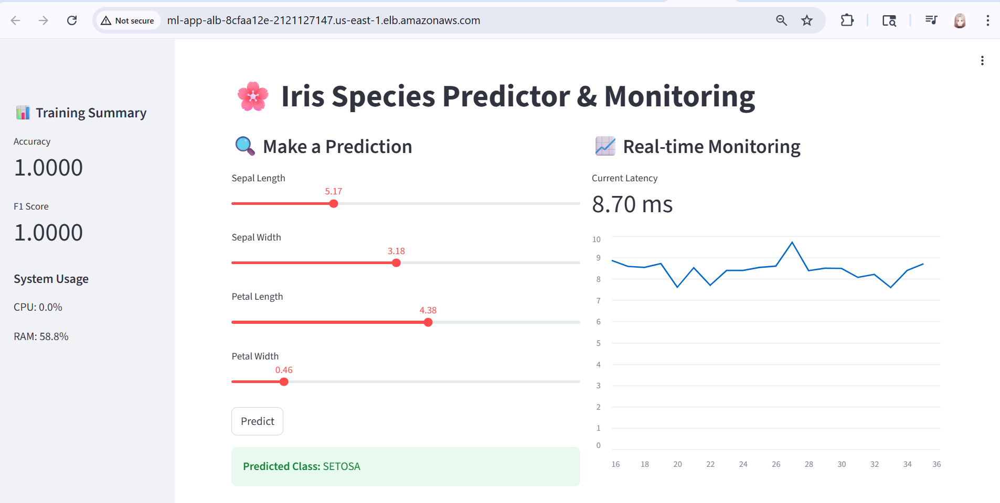
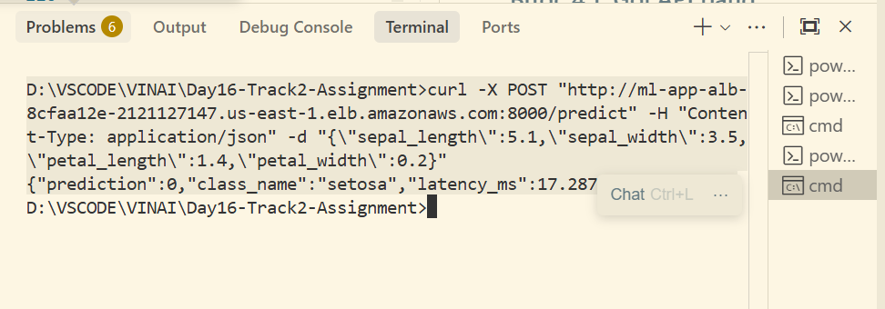
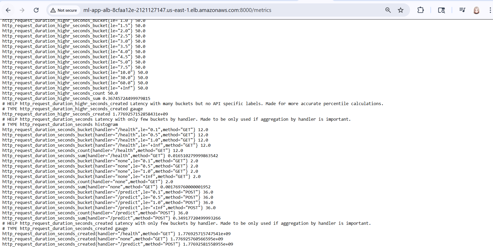
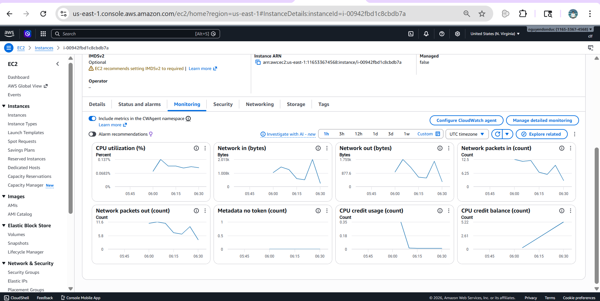
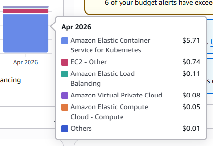

# 🚀 Báo cáo Lab 16: Triển khai Hệ thống ML Đơn giản trên AWS

**Họ và tên:** Nguyễn Đôn Đức
**Mã học viên:** 2A202600145
**Lớp:** Track 2 E403

---

## 🟢 PHẦN 1: TÓM TẮT BÁO CÁO KẾT QUẢ

### 1.1. Mục tiêu đạt được
Trong bài thực hành này, tôi đã thành công trong việc triển khai một hệ thống Machine Learning hoàn chỉnh trên môi trường Cloud AWS. Các mục tiêu cốt lõi đã hoàn thành bao gồm:
- **Hạ tầng tự động (IaC):** Sử dụng Terraform để khởi tạo VPC, Subnet, ALB và EC2 một cách nhất quán.
- **Phát triển Ứng dụng:** Xây dựng thành công bộ đôi FastAPI (Backend) và Streamlit (Frontend) để phục vụ dự đoán loài hoa Iris.
- **Tối ưu hóa chi phí:** Chuyển đổi kiến trúc từ GPU sang CPU (`t3.micro`) để tận dụng Free Tier nhưng vẫn đảm bảo hiệu năng.
- **Giám sát toàn diện:** Tích hợp thành công các chỉ số đo lường từ mức Model (Accuracy, F1) đến mức hạ tầng (CloudWatch).

### 1.2. Kết quả thực hiện
- Hệ thống chạy ổn định trong mạng riêng (Private Subnet).
- Giao diện Streamlit hiển thị trực quan các thông số huấn luyện và biểu đồ độ trễ dự đoán.
- API phản hồi nhanh chóng với độ trễ thấp (< 10ms cho phần inference).



---

## 🔵 PHẦN 2: CHI TIẾT KIẾN TRÚC & TRIỂN KHAI

## 2.1. Kiến trúc Hệ thống (Architecture)

Hệ thống được thiết kế theo mô hình chuẩn bảo mật trên AWS với VPC phân tầng. Ứng dụng chạy trong mạng riêng (Private Subnet) và chỉ có thể truy cập được thông qua Load Balancer.


### Các thành phần chính:
- **VPC & Networking:** Chia làm 2 lớp Public và Private. Các tài nguyên tính toán (EC2 t3.micro) nằm trong Private Subnet để đảm bảo an toàn.
- **ALB (Application Load Balancer):** Đóng vai trò là cửa ngõ tiếp nhận request và phân phối vào ứng dụng.
- **NAT Gateway:** Cho phép máy chủ trong Private Subnet kết nối ra Internet để tải thư viện.
- **Docker Container:** Đóng gói và chạy đồng thời quy trình Huấn luyện, API và UI.

---

## 2.2. Các thành phần Metrics được tích hợp
Hệ thống cung cấp các chỉ số quan trọng phục vụ quan sát:
- **Model Metrics:** Accuracy, Precision, Recall, F1-Score (tính toán sau khi Training).
- **System Metrics:** CPU & Memory usage trong quá trình Training.
- **Inference Metrics:** Độ trễ (Latency) theo thời gian thực hiển thị trên Streamlit.
- **Prometheus Metrics:** Endpoint `/metrics` sẵn sàng cho giám sát tập trung.

---

## 2.3. Các bước triển khai (Deployment Steps)

### Bước 1: Chuẩn bị môi trường Local
Đảm bảo đã cài đặt AWS CLI và Terraform.

### Bước 2: Khởi tạo Hạ tầng
```bash
cd terraform
terraform init
terraform validate
terraform apply -auto-approve
```

### Bước 3: Truy cập Ứng dụng
- `ui_url`: Truy cập giao diện Streamlit (Port 80).
- `api_url`: Endpoint FastAPI (Port 8000).

---

## 2.4. Hướng dẫn Giám sát & Kiểm tra

### Kiểm tra qua API (cURL)
**Dành cho CMD / Bash:**
```bash
curl -X POST http://<ALB_DNS_NAME>:8000/predict -H "Content-Type: application/json" -d "{\"sepal_length\": 5.1, \"sepal_width\": 3.5, \"petal_length\": 1.4, \"petal_width\": 0.2}"
```





### Giám sát trên AWS CloudWatch
- Theo dõi `TargetResponseTime` của ALB.
- Theo dõi `CPUUtilization` của EC2.



---

## 2.5. Kiểm tra Log & Troubleshooting
- **Cài đặt:** `tail -f /var/log/user-data.log` (trên máy ML Node).
- **Ứng dụng:** `docker logs -f ml-app-container`.

---

## 2.6. Dọn dẹp tài nguyên
```bash
terraform destroy -auto-approve
```

---
